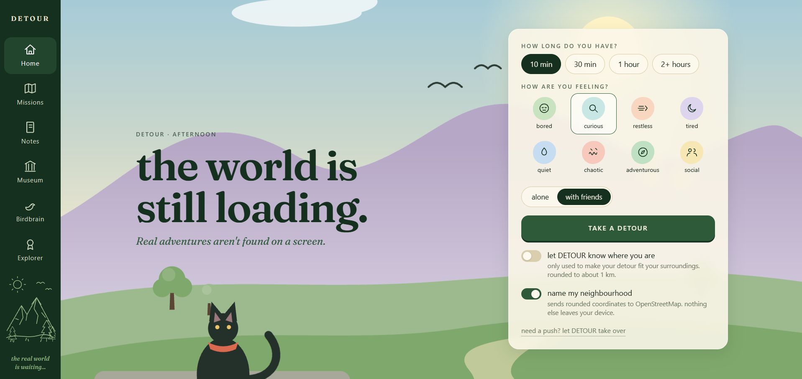
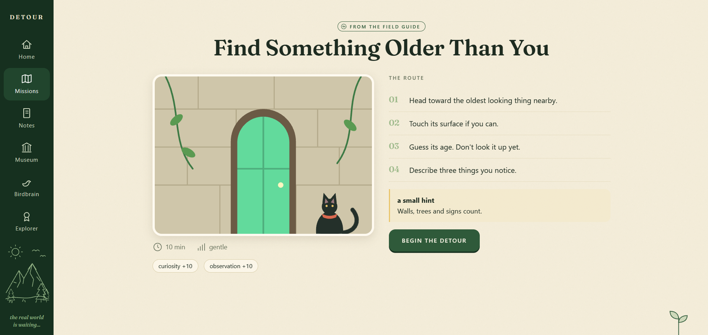
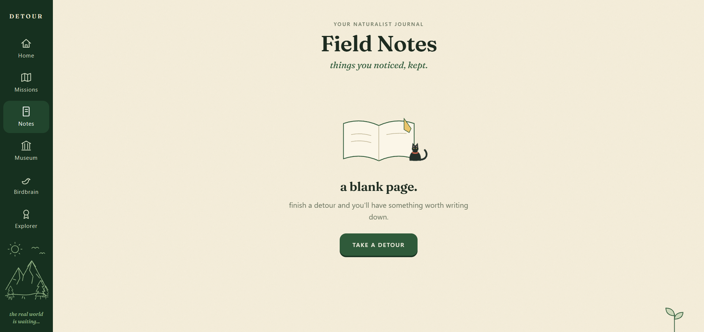
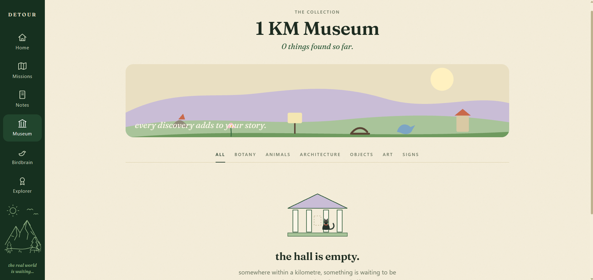
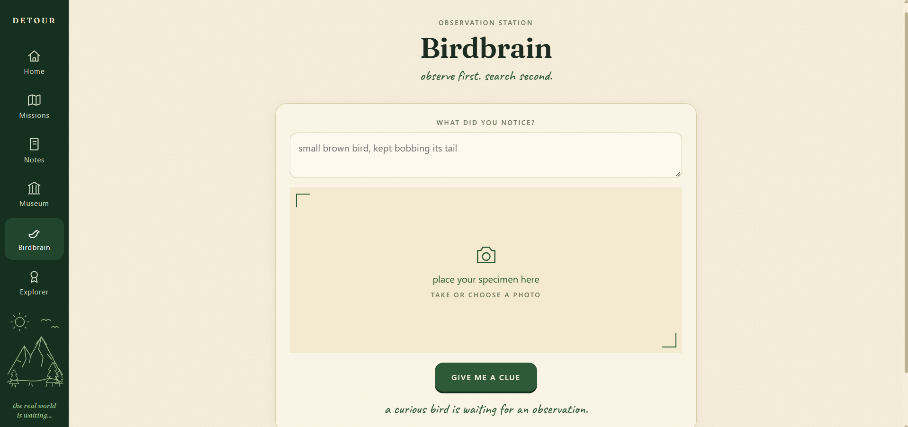

# DETOUR

> an open-AI adventure engine for people who forgot the world exists.

**the AI isn't the destination. it's the excuse to leave.**

I wanted to make an AI project that does something slightly backwards.

Most AI apps want you to keep talking to them.

I wanted to make one that tells you to put your phone down and go outside.

So yeah. DETOUR gives you little real-world missions based on how much time you have, your mood, whether you're alone or with friends, and what's happening outside.

You get the mission.

You go outside.

You do the weird little thing it tells you to do.

Then you come back and tell it what happened.

That's basically the whole idea.

**the screen is not the product. the walk is.**



---

## so... what does it actually do?

You tell DETOUR a few things about your situation and it comes up with an adventure.

Sometimes it's something simple like finding something yellow you've never noticed before.

Sometimes it's taking a wrong turn and seeing where you end up.

Sometimes it's something that makes you question why you agreed to this in the first place.

The missions can change depending on the weather, time of day, whether you're alone, and how much time you have.

The point isn't to give you another checklist to complete.

It's to give you a reason to actually look around.



---

## the AI part

DETOUR uses a Gemma-family model through Ollama.

I wanted the AI part to stay relatively simple instead of building an entire AI framework around it.

The app collects the context, sends it to the model, asks for a structured mission, and turns that into something you can actually go do.

And because I don't want the entire app to fall apart just because someone doesn't have Ollama running, there's also a built-in procedural generator.

So if there is no model available, DETOUR can still generate adventures.

That also makes the AI layer replaceable. You can experiment with different compatible models without rebuilding the entire application.

---

## missions

There are five stats hiding behind the adventures:

**exploration, curiosity, observation, courage and chaos.**

You earn XP as you complete things and eventually get increasingly questionable titles:

**Indoor Creature → Sidewalk Explorer → Park Gremlin → Neighborhood Witch → Horizon Chaser → Local Legend**

I have no idea how someone becomes a Neighborhood Witch.

Apparently by touching grass enough times.

---

## field notes

This is the part where you come back.

After a mission, you can write down what you actually found or what happened.

You can also attach a photo.

DETOUR can turn the note into a tiny journal-style reflection using the AI, but it is told not to invent things that weren't in your original note.

So your notes stay about what **you** actually saw.



---

## the museum

The things you find don't just disappear after the mission.

They can become part of your little personal museum.

It's basically a collection of things you probably would have walked past before DETOUR made you pay attention to them.

A weird object.

A plant.

A creature.

Something you couldn't explain.

Something that looked completely out of place.

It's not supposed to be a serious database.

It's your collection of things you noticed.



---

## birdbrain

Birdbrain is probably my favourite slightly weird part of DETOUR.

You find something outside.

Take a photo.

Describe what you noticed.

And instead of immediately telling you what it is, Birdbrain gives you three clues about what you should look at.

Because I don't really want the app to turn into:

> here is the answer, congratulations.

I'd rather it make you actually look at the thing.

**notice first. search second.**



---

## weather matters too

DETOUR doesn't treat weather as a random piece of information sitting somewhere in the app.

It becomes part of the mission.

Rain can push the generator toward sheltered adventures.

Different times of day can change what kind of things you are asked to notice.

The same mission shouldn't necessarily make sense at noon and at 8pm.

So weather and day/night information become part of the context sent to the adventure generator.

---

## going outside with other people

There are also missions meant for groups.

One of them basically tells everyone to pick a direction without explaining why and then see what happens.

Another one involves finding the weirdest thing within a certain distance and arguing about which one wins.

I wanted DETOUR to work when you're alone, but also when you're with people and need an excuse to do something stupid together.

---

# installation

You can run DETOUR completely locally.

You don't need an AI model just to try the application because DETOUR has a built-in procedural fallback.

If you want the full AI experience, you can optionally install Ollama and run a Gemma-family model locally.

---

## requirements

Before starting, make sure you have:

- Python 3.10 or newer
- pip
- Git

For the optional AI functionality:

- Ollama
- a compatible Gemma-family model

You do **not** need Ollama to run the basic application.

---

# running DETOUR locally

## 1. clone the repository

```bash
git clone https://github.com/mehroofsaba/Detour.git
```
